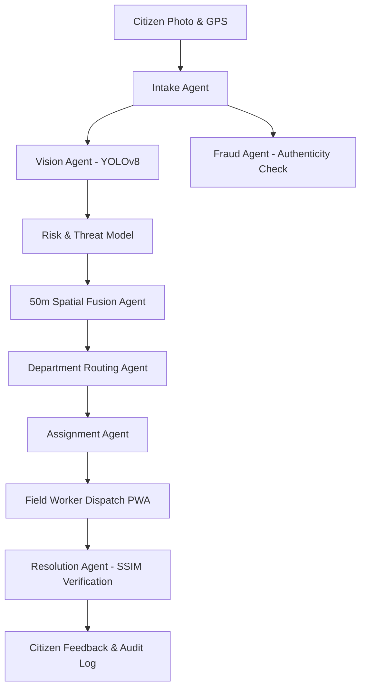

# 🛡️ CivicShield AI — Autonomous Multi-Agent Municipal Emergency Intelligence Platform

> **A Multi-Agent Urban Emergency Intelligence & Autonomous Hazard Response Platform** built for Municipal Governance, Smart Cities, and Final Year IT Project Defense.

---

## 🏛️ Executive Summary

CivicShield AI transitions municipal governance from slow, error-prone manual triage into an autonomous multi-agent operational grid:
- **Computer-Vision Threat Quantification**: Modular YOLO model classifying hazard types (potholes, flash floods, snapped utility poles, burst water mains) and measuring bounding box surface area ratios for depth/threat indexing.
- **50m Spatial Incident Fusion**: Automated clustering agent preventing duplicate tickets within a 50-meter radius, merging telemetry into a single master ticket.
- **Strict Role-Isolated Architecture**:
  - 🏛️ **Citizen Desk (`/citizen`)**: Verified citizen hazard reporting and resolution confirmation.
  - ⚡ **Department-Locked Officer Portal (`/officer`)**: Triage queues restricted by department (`Electricity`, `Municipal Works`, etc.) with 1-click crew dispatch.
  - 🛡️ **Executive Government Command (`/super-admin`)**: Full municipal situation map and the **FYP Simulation Suite**.
  - 👷 **Field Worker PWA (`/worker`)**: Mobile dispatch queue with Before / After image verification.
- **Next.js Middleware Security**: Enforces cookie-based JWT role isolation across all routes.
- **Dual Visual Themes**: Clean government Dark and Light modes powered by `next-themes`.

---

## 🚀 System Architecture



---

## 🔑 Pre-Seeded Evaluation Credentials (Viva Defense)

| Role | Email | Password | 2FA OTP | Target Portal |
| :--- | :--- | :--- | :--- | :--- |
| **Citizen** | `citizen@civicshield.gov` | `password123` | N/A | `/citizen` |
| **Power Lead** | `officer.elec@civicshield.gov` | `password123` | `1234` | `/officer` (Dept: Electricity) |
| **Works Lead** | `officer.works@civicshield.gov` | `password123` | `1234` | `/officer` (Dept: Municipal Works) |
| **Field Worker** | `worker.ali@civicshield.gov` | `password123` | N/A | `/worker` |
| **Super Admin** | `superadmin@civicshield.gov` | `password123` | `1234` | `/super-admin` |

---

## 💻 Tech Stack

### Frontend
- **Framework**: Next.js 16 (App Router, Webpack engine)
- **Styling**: Tailwind CSS, CSS variables, `next-themes` (Dark/Light mode)
- **Mapping**: Leaflet & React-Leaflet
- **Icons & Animation**: Lucide React, Framer Motion
- **State & Networking**: Zustand, Fetch API

### Backend
- **Framework**: FastAPI (Python 3.10+)
- **ORM & Database**: SQLAlchemy & SQLite / PostgreSQL
- **Security**: Direct Bcrypt hashing & SHA-256 JWT tokens
- **Intelligence**: YOLOv8 PyTorch inference, spatial Haversine distance clustering, SSIM verification

---

## 🛠️ Quick Start Guide

### 1. Backend Setup
```bash
cd backend
python -m venv .venv
# On Windows:
.venv\Scripts\activate
# On Linux/macOS:
source .venv/bin/activate

pip install -r requirements.txt
python -m app.db.seed
uvicorn app.main:app --host 127.0.0.1 --port 8000 --reload
```

### 2. Frontend Setup
```bash
cd frontend
npm install
npm run dev -- --webpack
```

Visit [http://localhost:3000](http://localhost:3000) to view the portal.
